  

 

 

---

### 🚀 About Me

I am a Fullstack Software Engineer focused on building robust, high-performance web applications. Combining deep backend expertise (PHP, Laravel, Go) with modern frontend development, I design scalable systems with clean UX.

Currently engineering **[LaundriGo](https://github.com/de-azaglo/laundriGo)** and expanding my runtime capabilities with Go and Flutter.

---

### 💻 Technologies & Tools

<table align="center" width="100%">
  <tr>
    <td width="50%" valign="top">
      <h4>Backend & Core</h4>
      
      
      
    </td>
    <td width="50%" valign="top">
      <h4>Frontend & Styling</h4>
      
      
      
      
    </td>
  </tr>
  <tr>
    <td width="50%" valign="top">
      <h4>Databases</h4>
      
      
    </td>
    <td width="50%" valign="top">
      <h4>Mobile & Infrastructure</h4>
      
      
    </td>
  </tr>
</table>

---

### 📊 Github Stats

  

---

  Designed with ❤️ by Derrick Azaglo

